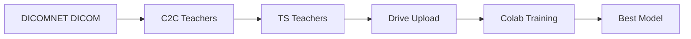

# 🚀 Hızlı Başlangıç: DICOMNET → Colab Eğitimi

## 📝 Özet İş Akışı



---

## 1️⃣ Lokal Gereksinimler (5 dakika)

### Python Paketleri:
```bash
cd ~/Desktop/L3_SO_ANALYSIS
source .venv/bin/activate

pip install pydicom nibabel
pip install git+https://github.com/StanfordMIMI/Comp2Comp.git
pip install TotalSegmentator>=2.3.0
```

### Sistem Araçları:
```bash
# macOS
brew install dcm2niix
```

---

## 2️⃣ Teacher Üretimi (2-6 saat, 50 vaka için)

### C2C Teachers:
```bash
python scripts/generate_c2c_teachers_local.py
```

**Çıktı:** `~/Desktop/C2C_teachers_local/` (~500MB-2GB)

### TS Teachers:
```bash
python scripts/generate_ts_teachers_from_c2c.py
```

**Çıktı:** `~/Desktop/TS_teachers_local/` (~1GB-3GB)

---

## 3️⃣ Google Drive'a Yükle (10-30 dakika)

### Manuel:
1. Finder'da sürükle-bırak:
   - `C2C_teachers_local/` → Drive: `C2C_teachers_DICOMNET/`
   - `TS_teachers_local/` → Drive: `TS_teachers_DICOMNET/`
   - `temp_nifti_for_c2c/` → Drive: `DICOMNET_nifti/`

### Otomatik (rclone):
```bash
# rclone kurulumu
brew install rclone
rclone config  # Google Drive ile sync ayarı

# Yükleme
rclone sync ~/Desktop/C2C_teachers_local/ "gdrive:C2C_teachers_DICOMNET/" --progress
rclone sync ~/Desktop/TS_teachers_local/ "gdrive:TS_teachers_DICOMNET/" --progress
rclone sync ~/Desktop/temp_nifti_for_c2c/ "gdrive:DICOMNET_nifti/" --progress
```

---

## 4️⃣ Colab Eğitimi (6-12 saat)

### Adımlar:
1. **Notebook Aç:** `notebooks/DICOMNET_colab_training.ipynb` → Google Colab'da aç
2. **GPU Seç:** Runtime → Change runtime type → GPU (T4/V100/A100)
3. **Hücreleri Sırayla Çalıştır:**
   - Cell 1-4: Setup (5 dk)
   - Cell 5-6: Veri yolları ve kontrol
   - Cell 7: Teacher birleştirme (10-30 dk)
   - Cell 8: Train/val split
   - Cell 9: DataLoader hazırlama
   - Cell 10-11: Model tanımlama
   - Cell 12: **60 epoch training** (6-12 saat) ⏱️
   - Cell 13: Training curves
   - Cell 14: Test inference

---

## 5️⃣ Model İndirme ve Test

### Drive'dan İndir:
- `L3_checkpoints/best_model.pt` → Desktop'a kaydet

### Desktop GUI'de Test:
```bash
cd ~/Desktop/L3_SO_ANALYSIS
python desktop_project/l3_vfa_pma_gui.py --model best_model.pt
```

### Radyolog Validasyon:
```bash
python desktop_project/optimize_params.py \
  --ref ground_truth.csv \
  --cases-dir DICOMNET \
  --model best_model.pt
```

---

## 📊 Başarı Kriterleri

- ✅ C2C + TS teacher üretimi: 45+ vaka başarılı
- ✅ Colab eğitim: 60 epoch tamamlanmış
- ✅ Best Dice score: >0.70
- ✅ VFA MAE: <50 mm²
- ✅ PMA MAE: <15 mm²

---

## 🐛 Sorun Giderme

### C2C Teacher Hatası:
```bash
# Comp2Comp kurulumu kontrol
python -c "from comp2comp import Comp2Comp; print('OK')"

# Yeniden kur
pip install --upgrade git+https://github.com/StanfordMIMI/Comp2Comp.git
```

### TS Teacher Hatası:
```bash
# TotalSegmentator versiyonu
TotalSegmentator --version  # 2.3.0+

# Yeniden kur
pip install --upgrade TotalSegmentator
```

### Colab OOM (Out of Memory):
```python
# Cell 9'da batch_size'ı düşür
train_loader = DataLoader(train_ds, batch_size=2, ...)  # 4 → 2
```

### Drive Quota Doldu:
- Eski checkpoint'leri sil: `L3_checkpoints/checkpoint_epoch_*.pt`
- Sadece `best_model.pt` sakla

---

## 📚 Ek Kaynaklar

- **Detaylı Rehber:** `DICOMNET_TO_COLAB_TRAINING.md`
- **Proje Dökümantasyonu:** `.github/copilot-instructions.md`
- **Ground Truth Validasyon:** `desktop_project/optimize_params.py --help`

---

## ✅ Checklist

- [ ] Lokal: Python paketleri kurulu
- [ ] Lokal: dcm2niix kurulu
- [ ] Lokal: C2C teachers üretildi (~/Desktop/C2C_teachers_local)
- [ ] Lokal: TS teachers üretildi (~/Desktop/TS_teachers_local)
- [ ] Drive: Teachers yüklendi (C2C_teachers_DICOMNET, TS_teachers_DICOMNET)
- [ ] Drive: NIfTI görüntüler yüklendi (DICOMNET_nifti)
- [ ] Colab: Notebook açıldı (DICOMNET_colab_training.ipynb)
- [ ] Colab: GPU runtime seçildi
- [ ] Colab: 60 epoch eğitim tamamlandı
- [ ] Lokal: best_model.pt indirildi
- [ ] Lokal: Desktop GUI'de test edildi
- [ ] Lokal: Radyolog GT ile validasyon yapıldı

**Tüm checklist tamamlandığında → Production-ready model! 🎉**
